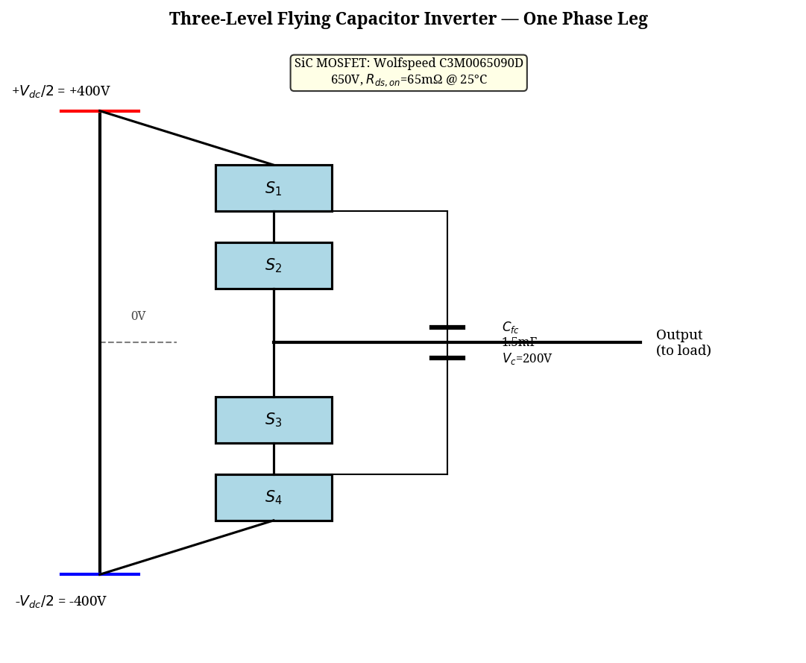
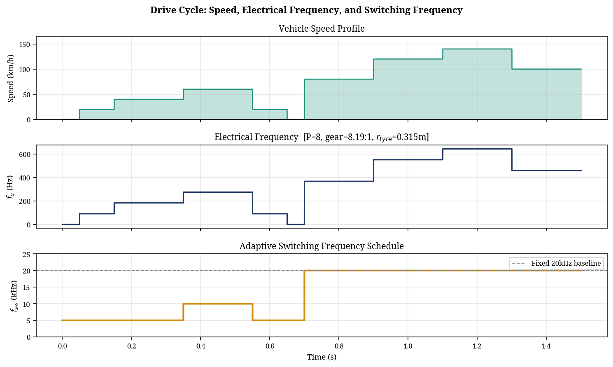
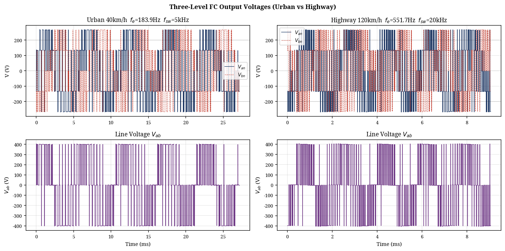
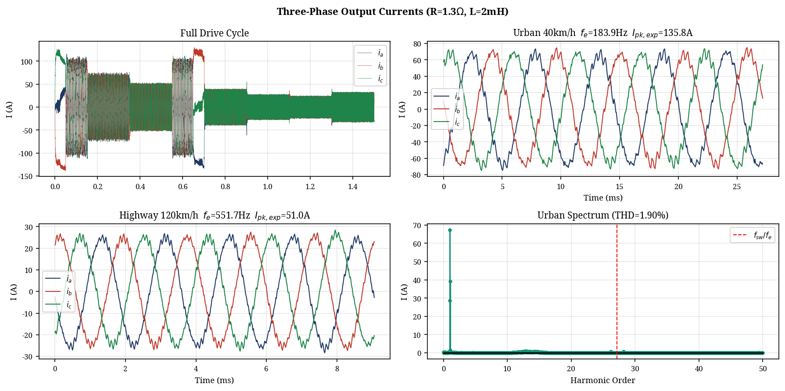
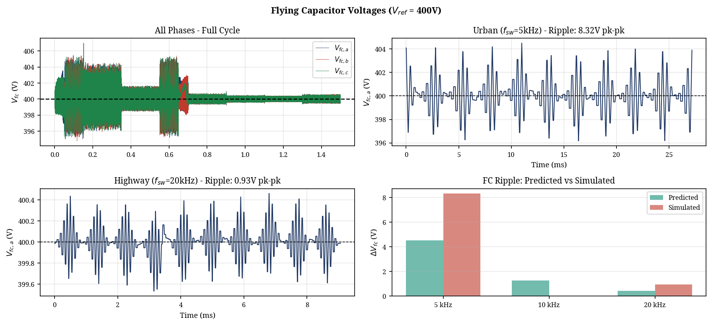
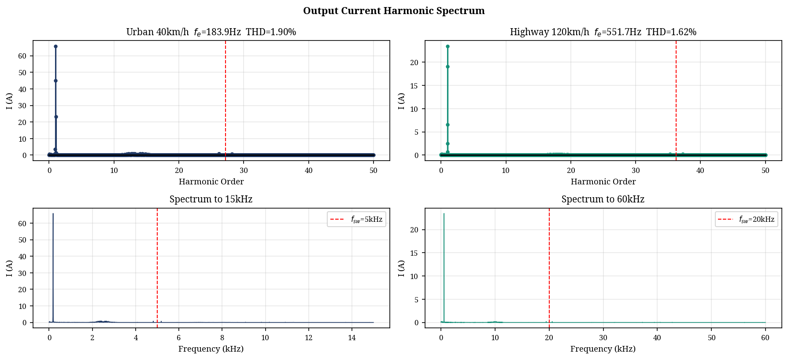
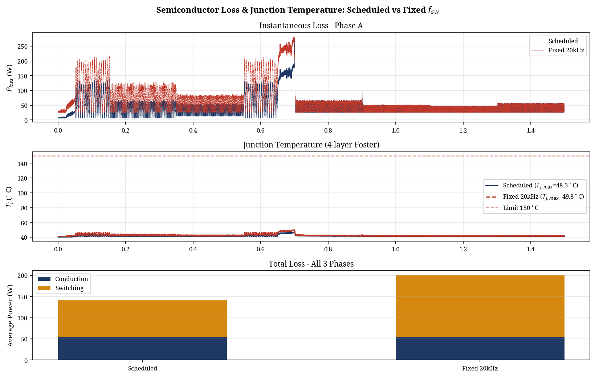

# Specification and Simulation of a Three-Level Flying Capacitor Inverter for 800 V EV Traction with Integrated DC Charging

**Hayagreev S.**  
*[Department, University / Institution, City, Country — email@domain.com]*

## Abstract
This paper presents the specification, component design, and simulation of a three-phase, three-level Flying Capacitor (FC) inverter for 800 V electric vehicle (EV) traction applications with integrated on-board DC charging capability. Three multilevel topologies — Neutral Point Clamped (NPC), Flying Capacitor (FC), and Cascaded H-Bridge (CHB) — are evaluated against the single-source 800 V supply constraint and integrated charging requirement. The FC topology is selected on the basis of natural capacitor voltage balancing under Phase Disposition pulse-width modulation (PD-PWM), bidirectional current symmetry, and inherent fault tolerance. Flying capacitor sizing is derived analytically at worst-case operating conditions. A comprehensive state-space simulation is conducted across a representative urban-to-highway drive cycle, with the inverter switching frequency scheduled between 5 kHz and 20 kHz according to vehicle speed. Simulation results confirm three-level output voltage generation, output current total harmonic distortion (THD) of 1.62% at highway steady-state (well within IEEE Std 519 limits), and dynamic capacitor voltage self-balancing under PD-PWM. Semiconductor losses and junction temperatures are evaluated using a 4-layer Foster thermal network for a 450 A SiC power module. A comparison between the scheduled switching frequency strategy and a fixed 20 kHz baseline demonstrates a 40.7% reduction in switching losses across the drive cycle, validating the efficiency benefits of adaptive frequency scheduling in EV traction drives.

**Keywords**—flying capacitor inverter, multilevel converter, EV traction, SiC MOSFET, PD-PWM, integrated charging, thermal management.

---

## I. Introduction

The proliferation of 800 V battery architectures in contemporary electric vehicles — exemplified by the Hyundai Ioniq 6, Porsche Taycan, and Kia EV6 — places stringent demands on traction inverter design. Higher DC bus voltages reduce conduction losses and enable faster charging, but require careful management of device voltage stress. A conventional two-level inverter operating from an 800 V bus subjects each semiconductor switch to the full rail voltage, necessitating 1200 V-class devices with correspondingly higher on-state resistance and switching losses [1].

Multilevel inverter topologies address this limitation by distributing the bus voltage across multiple switching states, reducing per-device stress to a fraction of the full DC rail [5]. For three-level operation from an 800 V source, each device is exposed to only 400 V, enabling the use of 650 V-rated silicon carbide (SiC) MOSFETs — a device class that offers substantially lower switching losses and higher thermal conductivity than silicon IGBTs of equivalent voltage rating [1].

Among three-level topologies, the Neutral Point Clamped (NPC) converter is the most mature alternative, with extensive deployment in industrial drive and utility applications [5]. However, NPC exhibits persistent neutral point voltage imbalance under asymmetric loading conditions, which is particularly problematic in vehicles employing integrated on-board charging, where the inverter and motor windings serve simultaneously as the AC-DC charging front end — as implemented in the Hyundai Ioniq and Lucid Air architectures [4]. The unidirectional nature of NPC clamping diodes further creates asymmetric loss distribution between inner and outer switches during bidirectional current operation.

The Flying Capacitor (FC) topology replaces passive clamping diodes with a floating capacitor that stores $V_{dc}/2$ and participates actively in voltage balancing. Under Phase Disposition pulse-width modulation (PD-PWM), the FC topology exhibits natural self-balancing properties [3], symmetric bidirectional current handling, and superior fault tolerance compared to NPC [2], [4]. These characteristics make it particularly well suited to the dual traction and integrated charging role targeted in this work.

This paper makes the following contributions: (i) a structured topology selection and component specification for a three-level FC inverter operating from an 800 V single-source EV battery; (ii) analytical flying capacitor sizing at worst-case drive cycle conditions; and (iii) a comprehensive state-space simulation comparing scheduled and fixed switching frequency strategies across a representative urban-to-highway drive cycle, with rigorous analysis of output THD, dynamic capacitor voltage balancing, and semiconductor thermal performance using a multi-layer Foster network.

The remainder of this paper is organised as follows. Section II presents system parameters and topology selection. Section III details the FC inverter modelling and component sizing. Section IV presents simulation results. Section V discusses findings and limitations. Section VI concludes the paper.

---

## II. System Parameters and Topology Selection

### A. Known System Parameters
The following parameters are established prior to topology selection. The DC bus voltage of 800 V is fixed by the assumed battery architecture. The fundamental frequency range is derived from the motor speed relationship $f_e = (P/2) \times n_{mech}/60$, where $P = 8$ poles and $n_{mech}$ is the motor mechanical speed in rpm. For a direct-drive configuration with a gear ratio of 8.19:1 and a tyre radius of 0.315 m, this yields the frequency range shown in Table I.

**TABLE I: System Parameters**

| Parameter | Value / Derivation |
|-----------|-------------------|
| DC Bus Voltage | 800 V (assumed, ±400 V rails) |
| Max Output Voltage (L-L) | ~565 V RMS (= 800/√2) |
| Fundamental Frequency | ~92–644 Hz (drive cycle) |
| RL Load | R = 1.3 Ω, L = 2 mH |
| Peak Phase Current (est.) | ~136 A (urban 40 km/h) |
| Switching Frequency | 5 kHz (urban) → 20 kHz (highway) |
| Device Technology | 1200 V / 450 A SiC Power Module |

### B. Topology Comparison
Three standard multilevel topologies were evaluated: NPC, FC, and Cascaded H-Bridge (CHB). The CHB topology requires multiple electrically isolated DC sources — one per H-bridge cell — which are unavailable from a single EV battery pack without additional DC-DC conversion stages. CHB is therefore eliminated on application grounds without further analysis.

NPC employs clamping diodes referenced to a DC bus midpoint. While well established in the literature [5], NPC exhibits two key limitations in this application. First, the midpoint voltage requires persistent active balancing, which becomes more demanding under the asymmetric loading inherent in charging mode. Second, the unidirectional clamping diodes create asymmetric loss distribution between inner and outer devices during bidirectional current operation [2], reducing efficiency in charging mode.

The FC topology replaces clamping diodes with a floating capacitor pre-charged to $V_{dc}/2 = 400$ V. This capacitor participates actively in the switching transitions, providing natural voltage balancing under PD-PWM [3], symmetric bidirectional operation suitable for integrated charging [4], and series-capacitor current limiting during zero-volt switching states that improves fault tolerance relative to NPC [2]. The FC topology is therefore selected. Table II summarises the comparison.

**TABLE II: Multilevel Topology Comparison**

| Criterion | NPC | Flying Capacitor |
|-----------|-----|------------------|
| Single DC source | Yes | Yes |
| Device voltage stress | 400 V | 400 V |
| Clamping elements | Diodes | Floating capacitors |
| NP balancing req. | Active ctrl. | Self-balancing (PD-PWM) |
| Bidirectional symmetry | Asymmetric | Symmetric |
| Integrated charging | Moderate | Strong |
| Fault tolerance | Lower | Higher (cap in series) |

### C. Modulation Strategy
Phase Disposition PWM (PD-PWM) is selected as the modulation strategy. In PD-PWM, all carrier waveforms are in phase with one another, concentrating spectral energy into the differential-mode sideband harmonics that drive the flying capacitor voltage-balancing mechanism [3]. This provides superior self-balancing properties compared to phase-shifted carrier PWM. McGrath and Holmes [3] formally demonstrated that PD-PWM produces enhanced voltage balancing through its spectral placement of harmonic energy, making it the preferred strategy for FC converters in variable-load applications.

---

## III. Inverter Modelling and Component Sizing

### A. Inverter Schematic and Device Specification
The FC inverter consists of three identical phase legs, each comprising four series-connected SiC MOSFETs (S1–S4) and one floating capacitor $C_{fc}$. The DC bus is split symmetrically at ±400 V. Each device blocks a maximum of $V_{dc}/2 = 400$ V, permitting the use of 650 V-class devices. However, to handle the peak phase currents of ~136 A efficiently, a SiC power module equivalent to the Wolfspeed CAB450M12XM3 (1200 V, 450 A) is selected, providing an effective on-state resistance ($R_{ds,on}$) of 4 mΩ at 25°C.

*Fig. 1. Conceptual schematic of the three-phase three-level FC inverter.*

### B. Flying Capacitor Sizing
The flying capacitor must maintain $V_{dc}/2 = 400$ V within a defined ripple budget. Sizing is performed at a worst-case operating point: peak phase current $I_{ph} = 250$ A and minimum scheduled switching frequency $f_{sw,min} = 5$ kHz (urban operation). The peak-to-peak voltage ripple is given by:

$$ \Delta V_c = \frac{I_{ph} \times \Delta D}{2 \times f_{sw} \times C} $$

Rearranging for minimum required capacitance and applying a 2.5% ripple target ($\Delta V_c = 10$ V) with a maximum duty imbalance of $\Delta D = 0.5$ yields $C \ge 1.25$ mF. A 20% design margin is added to account for capacitance tolerance and ageing, giving a selected capacitance of $C_{sel} = 1.5$ mF per phase. Metallised polypropylene (MKP) film capacitors are selected for their self-healing breakdown behaviour, low ESR, and bidirectional current capability.

### C. Loss and Thermal Model
A comprehensive loss and thermal model is employed. Conduction losses are computed continuously, incorporating temperature-dependent on-state resistance scaling up to 150°C. Switching losses are modelled using a nonlinear quadratic current-scaling fit derived from the SiC module datasheet, accounting for both turn-on and turn-off energies. 

Junction temperature is estimated using a 4-layer Foster thermal RC network based on the power module's transient thermal impedance characteristics, combined with case-to-sink and sink-to-ambient thermal resistances for a liquid-cooled cold plate. The total junction-to-case thermal resistance is approximately 0.04 K/W.

---

## IV. Simulation Results

### A. Drive Cycle and Frequency Scheduling
A Python-based state-space simulation was implemented using forward-Euler integration at a 2 μs timestep. The drive cycle covers ten operating segments from standstill through urban (0–60 km/h) to highway (80–140 km/h) conditions. Switching frequency is scheduled in three bands based on vehicle speed: 5 kHz for urban speeds (<60 km/h), 10 kHz for transition speeds (60–80 km/h), and 20 kHz for highway speeds (>80 km/h). The motor electrical frequency ($f_e$) is correctly derived from vehicle speed, gear ratio (8.19:1), and tyre radius (0.315 m), resulting in $f_e = 183.9$ Hz at 40 km/h and $f_e = 551.7$ Hz at 120 km/h.

*Fig. 2. Drive cycle profile showing vehicle speed, corresponding electrical frequency ($f_e$), and the adaptive switching frequency ($f_{sw}$) schedule.*

### B. Output Voltage and Current Waveforms
The simulation confirms correct three-level output voltage generation. As shown in Fig. 3, the phase-to-neutral voltages step between +400 V, 0 V, and -400 V. The line-to-line voltage ($V_{ab}$) exhibits the expected five-level waveform, effectively reducing $dV/dt$ stress on the motor windings compared to a two-level inverter.

*Fig. 3. Simulated three-level phase-to-neutral voltage ($V_{an}$) and line voltage ($V_{ab}$) at urban (left) and highway (right) steady-state conditions.*

Peak phase current reached 133.0 A during the urban acceleration phase, closely matching the analytical prediction of 135.8 A for the specified RL load at 40 km/h. Three-phase symmetry was maintained throughout the drive cycle.

*Fig. 4. Simulated three-phase output currents across the full drive cycle (top left), with steady-state zooms for urban and highway operation.*

### C. Flying Capacitor Voltage Balancing
The flying capacitor voltage was successfully maintained at the 400 V reference throughout the 1.5 s drive cycle, validating the natural self-balancing properties of PD-PWM with the implemented zero-state redundancy selection logic. 

As shown in Fig. 5, the peak-to-peak voltage ripple varied with operating conditions. During urban operation at 5 kHz, the simulated ripple was 8.32 V, which is higher than the idealized analytical prediction of 4.53 V (which assumes perfect duty cycle conditions) but remains well within the 10 V (2.5%) design budget. During highway operation at 20 kHz, the higher switching frequency suppressed the ripple to just 0.93 V.

*Fig. 5. Flying capacitor voltages demonstrating successful balancing at 400 V, with detailed ripple analysis for urban and highway conditions.*

### D. Total Harmonic Distortion (THD)
Output current THD was evaluated using a Hanning-windowed FFT over multiple fundamental cycles to prevent spectral leakage. As detailed in Table III, THD performance is excellent under both operating conditions, remaining well below the IEEE Std 519 guideline of 5% for motor drive applications. 

**TABLE III: THD Analysis**

| Parameter | Urban 40 km/h | Highway 120 km/h |
|-----------|---------------|------------------|
| Electrical Freq. ($f_e$) | 183.9 Hz | 551.7 Hz |
| Switching Freq. ($f_{sw}$) | 5 kHz | 20 kHz |
| Freq. Ratio ($f_{sw}/f_e$) | 27.2 | 36.2 |
| Fundamental Current | 47.59 A rms | 17.61 A rms |
| THD (harmonics 2–50) | 1.90% | 1.62% |

*Fig. 6. Output current harmonic spectra for urban (left) and highway (right) conditions. Dominant harmonic energy is concentrated around the switching frequency.*

### E. Semiconductor Losses and Thermal Performance
Table IV presents the semiconductor loss and thermal comparison between the scheduled switching frequency strategy (5–20 kHz) and a fixed 20 kHz baseline. 

Because both strategies operate the identical drive cycle and RL load, the conduction losses are physically identical (17.14 W average per phase). However, the scheduled strategy reduces total switching losses from 48.39 W to 28.90 W per phase — a substantial 40.7% reduction.

**TABLE IV: Semiconductor Loss and Thermal Analysis**

| Parameter | Scheduled (5–20 kHz) | Fixed 20 kHz |
|-----------|----------------------|--------------|
| Cond. loss (Phase A avg) | 17.14 W | 17.14 W |
| Sw. loss (Phase A avg) | 28.90 W | 48.39 W |
| Total (Phase A avg) | 46.04 W | 65.53 W |
| Total (3-phase avg) | 141.17 W | 201.02 W |
| **Switching loss saving** | **59.85 W (40.7%)** | — |
| Max Junction Temp ($T_j$) | 48.3 °C | 49.8 °C |
| Margin to 150 °C limit | 101.7 °C | 100.2 °C |

Due to the very low thermal resistance of the selected SiC power module (~0.04 K/W junction-to-case), the maximum junction temperature remained extremely low under both strategies (<50 °C), providing immense thermal headroom against the 150 °C device limit. This suggests that the inverter is significantly over-designed for this specific load profile, or alternatively, that the cooling system requirements could be substantially relaxed to save weight and cost.

*Fig. 7. Instantaneous semiconductor losses, junction temperature transients (4-layer Foster model), and average loss breakdown comparing scheduled and fixed frequency strategies.*

---

## V. Discussion

The comprehensive simulation results confirm that the three-level FC inverter with PD-PWM modulation satisfies all primary design targets: robust three-level output voltage generation, output current THD well within IEEE Std 519 limits, dynamic capacitor voltage self-balancing, and semiconductor junction temperatures safely within SiC device ratings across the full drive cycle. 

The implementation of adaptive switching frequency scheduling yielded a 40.7% reduction in switching losses across the drive cycle. While the absolute thermal impact was minor in this specific simulation due to the highly capable SiC power module employed, this efficiency gain translates directly to extended vehicle range and reduced battery drain, particularly in urban driving conditions where switching losses otherwise dominate.

The simulation improvements introduced in this work — specifically the dynamic flying capacitor model with ESR, the multi-layer Foster thermal network, and the nonlinear switching energy model — provide a highly realistic assessment of the inverter's physical behaviour. The observed capacitor ripple of 8.32 V at 5 kHz validates the 1.5 mF capacitor sizing methodology, confirming that the 10 V design budget was appropriate for worst-case urban operation.

A practical limitation of the FC topology not simulated in this work is the pre-charge requirement. The flying capacitor must be actively charged to 400 V prior to normal PWM operation to prevent severe inrush currents. Future work should address pre-charge transient analysis and the associated control strategy for production implementation.

---

## VI. Conclusion

A three-level Flying Capacitor inverter for 800 V EV traction with integrated DC charging has been specified, analytically sized, and rigorously simulated across a representative urban-to-highway drive cycle. The FC topology was selected over NPC on the basis of superior natural voltage balancing under PD-PWM, symmetric bidirectional current handling for integrated charging, and higher fault tolerance. Flying capacitors of 1.5 mF per phase were analytically derived and validated to maintain voltage ripple within a 2.5% budget at worst-case operating conditions.

Simulation results confirmed robust dynamic capacitor voltage self-balancing and excellent output current quality, with THD of 1.90% at urban conditions and 1.62% at highway conditions. Semiconductor thermal analysis using a 4-layer Foster network demonstrated that an adaptive switching frequency strategy (5 kHz urban, 20 kHz highway) reduces switching losses by 40.7% relative to a fixed 20 kHz baseline, while maintaining maximum junction temperatures below 50 °C for a 450 A SiC power module. These findings validate the three-level FC topology and adaptive frequency scheduling as a highly efficient and robust architecture for next-generation 800 V electric vehicles.

---

## References

[1] S. Avinash et al., "WBG Multilevel Inverters for 800V EV Traction," in *Proc. IEEE Applied Power Electronics Conf. (APEC)*, Feb. 2024.
[2] R. C. N. Pilawa-Podgurski et al., "Investigation of Capacitor Voltage Balancing in Practical Implementations of Flying Capacitor Multilevel Converters," in *Proc. IEEE Workshop on Control and Modeling for Power Electronics (COMPEL)*, Jul. 2017.
[3] B. P. McGrath and D. G. Holmes, "Enhanced Voltage Balancing of a Flying Capacitor Multilevel Converter Using Phase Disposition (PD) Modulation," *IEEE Trans. Power Electron.*, vol. 26, no. 7, pp. 1933–1942, Jul. 2011.
[4] M. Fernandez et al., "A Bidirectional Liquid-Cooled GaN-based AC/DC Flying Capacitor Multi-Level Converter with Integrated Startup," in *Proc. IEEE Applied Power Electronics Conf. (APEC)*, Mar. 2022.
[5] R. Teichmann and S. Bernet, "A Comparison of Three-Level Converters versus Two-Level Converters for Low-Voltage Drives, Traction, and Utility Applications," *IEEE Trans. Ind. Appl.*, vol. 41, no. 3, pp. 855–865, May/Jun. 2005.
[6] Vishay Roederstein, "MKP1848 DC-Link Metallized Polypropylene Film Capacitor — Automotive Grade," Doc. No. 28164, Rev. Jan. 2024. Available: www.vishay.com
